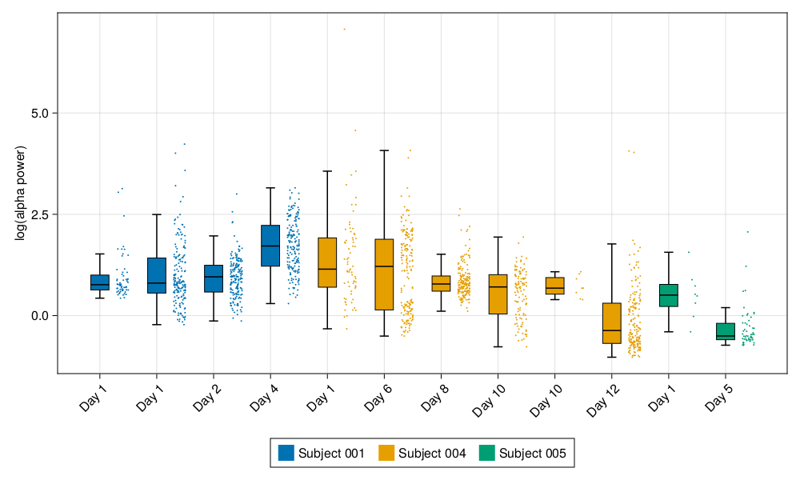

# CAR-T / SpotLite spectral analysis

The scripts in this folder plots per-recording spectral power distributions for a selection of SpotLite EEGs from CAR-T patients to include as pilot data for an SBIR resubmission. 

`spectral_features.jl` computes spectral features for 6 subjects identified by Jay and saves them as an .arrow table for plotting.

`plotting.jl` generates raincloud plots for recordings from three subjects:
- 001 (blue): never develops encephalopathy
- 004 (yellow): develops encephalopathy after SpotLite recordings
- 005 (green): already has encephalopathy at time of SpotLite recordings

[TrialData.md](TrialData.md) contains per-subject notes about enchephalopathy status w/r/t SpotLite recording dates, as well as per-recording notes and portal links.

[figures.md](figures.md) contains a figure showing example PSD plots for up to 6 recordings for each of the 6 subjects, computed in the process of finalizing the plots to be included in the SBIR. 

Final raincloud plots and the spectral features table are on S3 at `s3://beacon-sandbox/bizops-clinops/car-t/spectral-features/`. There is one plot per frequency band, both for un-normalized spectral power and relative power (e.g., alpha / (delta + theta + alpha + beta)), making 8 plots total. The example plot below shows alpha power for the recordings and subjects of interest. 

